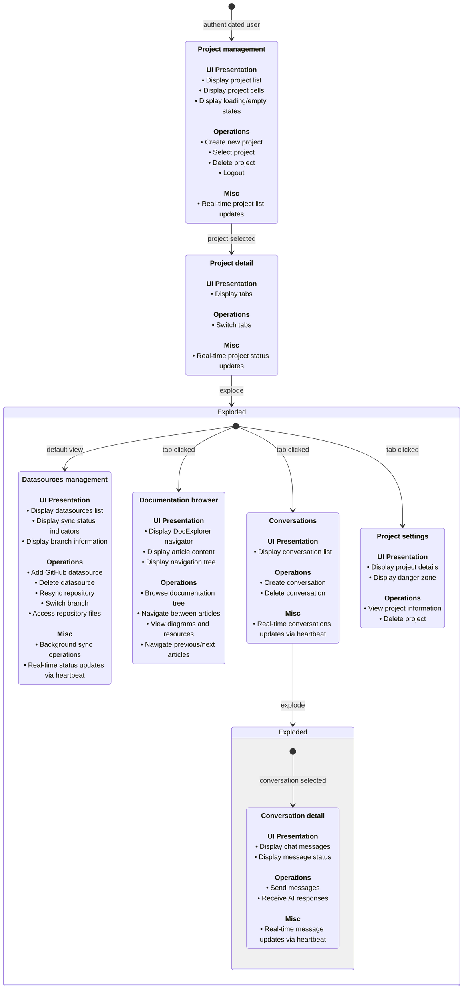

```mermaid
stateDiagram-v2
    [*] --> ProjectListView: authenticated user
 
    ProjectListView: **Project management**<br/><br/>**UI Presentation**<br/>• Display project list<br/>• Display project cells<br/>• Display loading/empty states<br/><br/>**Operations**<br/>• Create new project<br/>• Select project<br/>• Delete project<br/>• Logout<br/><br/>**Misc**<br/>• Real-time project list updates 

    ProjectDetail: **Project detail**<br/><br/>**UI Presentation**<br/>• Display tabs<br/><br/>**Operations**<br/>• Switch tabs<br/><br/>**Misc**<br/>• Real-time project status updates
    ProjectDetailExploded: Exploded
    state ProjectDetailExploded {
        Datasources: **Datasources management**<br/><br/>**UI Presentation**<br/>• Display datasources list<br/>• Display sync status indicators<br/>• Display branch information<br/><br/>**Operations**<br/>• Add GitHub datasource<br/>• Delete datasource<br/>• Resync repository<br/>• Switch branch<br/>• Access repository files<br/><br/>**Misc**<br/>• Background sync operations<br/>• Real-time status updates via heartbeat

        Documentation: **Documentation browser**<br/><br/>**UI Presentation**<br/>• Display DocExplorer navigator<br/>• Display article content<br/>• Display navigation tree<br/><br/>**Operations**<br/>• Browse documentation tree<br/>• Navigate between articles<br/>• View diagrams and resources<br/>• Navigate previous/next articles

        Conversations: **Conversations**<br/><br/>**UI Presentation**<br/>• Display conversation list<br/><br/>**Operations**<br/>• Create conversation<br/>• Delete conversation<br/><br/>**Misc**<br/>• Real-time conversations updates via heartbeat

        ConversationsExploded: Exploded

        state ConversationsExploded {

             ConversationDetailView: **Conversation detail**<br/><br/>**UI Presentation**<br/>• Display chat messages<br/>• Display message status<br/><br/>**Operations**<br/>• Send messages<br/>• Receive AI responses<br/><br/>**Misc**<br/>• Real-time message updates via heartbeat

             [*] --> ConversationDetailView: conversation selected
        }

        Conversations --> ConversationsExploded: explode


        Settings: **Project settings**<br/><br/>**UI Presentation**<br/>• Display project details<br/>• Display danger zone<br/><br/>**Operations**<br/>• View project information<br/>• Delete project

        [*] --> Datasources: default view
        [*] --> Documentation: tab clicked
        [*] --> Conversations: tab clicked
        [*] --> Settings: tab clicked
    }

    ProjectListView --> ProjectDetail: project selected

    ProjectDetail --> ProjectDetailExploded: explode
```